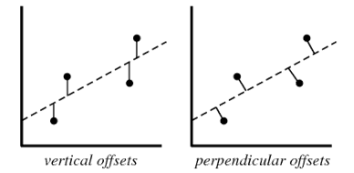
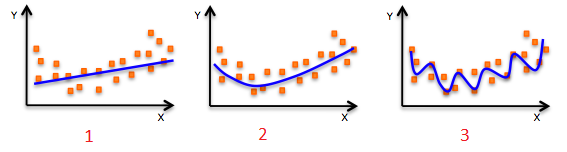
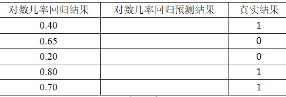

# 一、单选题（共16题； 共32.0分）

1、机器学习算法的三要素不包括以下哪个方面？

A. 模型

B. 数据

C. 优化算法

D. 学习准则

---

2、在回归模型中，下列哪⼀项在权衡⽋拟合(under-fitting)和过拟合(over-fitting)中影响最⼤？

A. 多项式阶数

B. 更新权重w时，使⽤的是矩阵求逆还是梯度下降

C. 使⽤常数项

D. 以上都不正确

---

3、如果我们说"线性回归"模型完美地拟合了训练样本（训练样本误差为零），则下⾯哪个说法是正确的？

A. 测试样本误差始终为零

B. 测试样本误差不可能为零

C. 测试样本误差不确定

D. 以上答案都不正确

---

4、关于 L1、L2 正则化下列说法正确的是

A. L2 正则化能防⽌过拟合，提升模型的泛化能⼒，但 L1 做不到这点

B. L2 正则化技术⼜称为 Lasso Regularization

C. L1 正则化得到的解更加稀疏

D. L2 正则化得到的解更加稀疏

---

5、Sigmoid函数的导数是以下哪一个？

A. 1-y

B. 1-lnx

C. y(1-y)

D. 1+lnx

---

6、下⾯关于ID3算法中说法错误的是？

A. ID3算法要求特征必须离散化

B. 信息增益可以⽤熵，⽽不是GINI系数来计算

C. 选取信息增益最⼤的特征，作为树的根节点

D. ID3算法是⼀个⼆叉树模型

---

7、下列哪一种偏移，是我们在线性回归模型计算损失函数，例如均方差损失函数时使用的？

（图中横坐标是输入 X，纵坐标是输出 Y）

A. 垂直偏移（vertical offsets）

B. 垂向偏移（perpendicular offsets）

C. 两种偏移都可以

D. 以上说法都不对

---

8、对数几率回归（Logistic Regression）将输出概率限定在（0,1） 之间。下列哪个函数起到这样的作用？

A. Leaky ReLU 函数

B. Sigmoid 函数

C. tanh 函数

D. ReLU 函数

---

9、目标变量在训练集上的 8 个实际值 [0,0,0,1,1,1,1,1]，目标变量的熵是多少？

A. 图2

B. 图3

C. 图4

D. 图5

---

10、关于欠拟合（under-fitting），下面哪个说法是正确的？

A. 训练误差较大，测试误差较小

B. 训练误差较小，测试误差较大

C. 训练误差较大，测试误差较大

D. 以上都不对

---

11、下面哪句话是正确的？

A. 机器学习模型的查全率越高，则模型的性能越好

B. 增加模型的复杂度，总能减小测试样本误差

C. 增加模型的复杂度，总能减小训练样本误差

D. 以上说法都不对

---

12、假如使用一个较复杂的回归模型来拟合样本数据，使用 Ridge 回归（加入L2正则项的线性回归），调试正则化参数 λ，来降低模型复杂度。若 λ 较大时，关于偏差（bias）和方差（variance），下列说法正确的是？

A. 若 λ 较大时，偏差减小，方差减小

B. 若 λ 较大时，偏差减小，方差增大

C. 若 λ 较大时，偏差增大，方差减小

D. 若 λ 较大时，偏差增大，方差增大

---

13、假如你在训练一个线性回归模型，有下面两句话：（1）如果数据量较少，容易发生过拟合。（2）如果假设空间较小，容易发生过拟合。关于这两句话，下列说法正确的是？

A. （1）和 （2） 都错误

B. （1） 正确，（2） 错误

C. （1） 错误，（2） 正确

D. （1） 和 （2） 都正确

---

14、假设使用对数几率回归进行多分类，使用 One-vs-rest 分类法。说法正确的是

A. 对于 n 类别，需要训练 n 个模型

B. 对于 n 类别，需要训练 n-1 个模型

C. 对于 n 类别，只需要训练 1 个模型

D. 以上说法都不对

---

15、评估完模型之后，发现模型存在高偏差（high bias），应该如何解决？

A. 减少模型的特征数量

B. 增加模型的特征数量

C. 增加样本数量

D. 以上说法都正确

---

16、假设已经训练好了用于房价预测的正则化线性模型，但是当在新的数据上进行测试时出现了很严重的预测错误，下一步该怎么办？

A. 尝试加入其它附加特征

B. 尝试加入多项式组合特征

C. 尝试减小正则化参数

D. 尝试增大正则化参数

---

# 二、多选题（共4题； 共12.0分）

1、对于一个二分类问题，假设已经建好了模型，输出是0或1，初始时设阈值为0.5，概率超过0.5，类别就判别为1，否则为0；如果现在修改阈值为0.6，那么关于分类模型的以下描述，正确的是

A. 模型的分类查准率会降低

B. 模型的分类查准率会升高

C. 模型的分类查全率会降低

D. 模型的分类查全率会升高

---

2、下面三张图展示了对同一训练样本，使用不同的模型拟合的效果（蓝色曲线）。那么，我们可以得出哪些结论？

A. 第 1 个模型的训练误差大于第 2 个、第 3 个模型

B. 最好的模型是第 3 个，因为它的训练误差最小

C. 第 2 个模型的泛化能力强，对未知样本的拟合效果最好

D. 第 3 个模型发生了过拟合

---

3、下列关于 Ridge 回归（加入L2正则项的线性回归），说法正确的是？

A. 若 λ=0，则等价于一般的线性回归

B. 若 λ=0，则不等价于一般的线性回归

C. 若 λ=+∞，则得到的权重系数很小，接近于零

D. 若 λ=+∞，则得到的权重系数很大，接近与无穷大

---

4、关于梯度下降的基本原理，以下哪些说法是正确的？

A. 梯度方向是函数值增加最快的方向

B. 在最小化损失函数时，我们沿着负梯度方向更新参数

C. 学习率决定了每一步更新的幅度，学习率越大收敛越快

D. 梯度下降的最终目标是在训练集上找到损失函数的全局最小值

---

# 三、简答题（共4题； 共36.0分）

1、简述机器学习，以及监督学习、无监督学习；（6.0分）

---

2、简述机器学习的一般步骤；（10.0分）

---

3、预测 20 个西瓜中哪些是好瓜，这 20 个西瓜中实际有 15 个好瓜，5个坏瓜。某个模型预测的结果是：16 个好瓜，4 个坏瓜。其中，预测的 16 个好瓜中有14 个确实是好瓜，预测的 4 个坏瓜中有 3 个确实是坏瓜。注：好瓜为正例，坏瓜为反例。（10.0分）

（1）画出混淆矩阵；

（2）什么是精确率（Presion），计算准确率 P；

（3）什么是召回率（Recall），计算召回率 R；

（4）写出 F1 值的计算公式，求出本例中 F1 值。

---

4、已知对数几率回归模型得到一组结果，要求：（10.0分）

（1）假设阈值为 0.6，写出预测结果。

（2）计算出损失函数的值（即真实值与预测值之间的损失值）。

| 对数几率回归结果 | 对数几率回归预测结果 | 真实结果 |
| ---------------- | -------------------- | -------- |
| 0.40             | 0                    | 1        |
| 0.65             | 1                    | 0        |
| 0.20             | 0                    | 0        |
| 0.80             | 1                    | 1        |
| 0.70             | 1                    | 1        |

---
