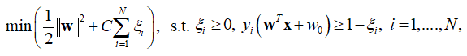

# 机器学习测试 (Test 3)

## 一、单选题（共8题； 共24.0分）

**1. 下列关于支持向量机的用法正确的是？**

* A. 当数据是线性可分时，可以考虑支持向量机的基本型
* B. 当数据是线性不可分时，可以考虑引入核函数的支持向量机
* C. 若使用引入核函数的支持向量机，可以通过模型选择等技术挑选较为合适的核函数
* D. 以上说法都是正确的

**2. 一个正例(2,3)，一个负例(0,-1)，下面哪个是SVM超平面?**

* A. 2x+y-4=0
* B. x+2y-3=0
* C. 2y+x-5=0
* D. 无法计算

**3. 下列关于支持向量回归说法正确的是？**

* A. 当样本距离超平面的距离小于一定程度时，没有损失
* B. 解具有稀疏性
* C. 当样本距离超平面的距离大于一定程度时，有损失且损失随着距离线性增加
* D. 以上说法都是正确的

**4. 以下算法不属于生成模型的是？**

* A. 支持向量机
* B. 朴素贝叶斯模型
* C. 半朴素贝叶斯模型
* D. 贝叶斯网

**5. 关于拉普拉斯平滑说法正确的是？**

* A. 加上拉普拉斯平滑有助于提高学习性能
* B. 会使得最终结果可能大于1
* C. 避免了出现概率为0的情况
* D. 以上都不对

**6. 假设X和Y都服从正态分布，那么P(X<5,Y<0)就是一个（    ），表示X<5,Y<0两个条件同时成立的概率，即两个事件共同发生的概率。**

* A. 先验概率
* B. 后验概率
* C. 联合概率
* D. 以上都不对

**7. 以下哪个选项是对贝叶斯最优分类器的描述？**

* A. 对每个样本x选择能使后验概率P(c|x)最大的类别标记
* B. 对每个样本x选择能使后验概率P(c|x)最小的类别标记
* C. 对每个样本x选择能使条件风险R(ci|x)最大的类别标记
* D. 对每个样本x选择能使条件风险R(ci|x)最小的类别标记

**8. 关于朴素贝叶斯，下列说法错误的是？**

* A. 朴素的意义在于它的一个假设：所有特征之间是相互关联的
* B. 它是一个分类算法
* C. 朴素贝叶斯需要使用联合概率
* D. 它实际上是将多条件下的条件概率转换成了单一条件下的条件概率，简化了计算

---

## 二、多选题（共2题； 共6.0分）

**1. 以下关于支持向量机的说法正确的是？**

* A. SVM适用于大规模数据集
* B. SVM分类面取决于支持向量
* C. SVM分类思想就是将分类面之间的间隔最小化
* D. SVM方法简单，鲁棒性较好

**2. 下面关于支持向量机的描述正确的是？**

* A. 是一种监督学习的方法
* B. 可用于多分类的问题
* C. 是一种生成模型
* D. 支持非线性的核函数

---

## 三、判断题（共5题； 共10.0分）

**1. “硬间隔”是指SVM允许分类时出现一定范围的误差。**

**2. SVM中的泛化误差代表SVM对新数据的预测准确度。**

**3. 若参数C（cost parameter）被设为无穷，只要最佳分类超平面存在，它就能将所有数据全部正确分类。**

**4. SVM中核函数将高维空间中的数据映射到低维空间。**

**5. 支持向量机不会受到噪声的影响。**

---

## 四、分析题

**考虑带松弛因子的线性SVM分类器：**
`min 1/2 ||w||^2 + C * sum(xi)`
**下面有一些关于某些变量随参数C的增大而变化的表述。如果表述总是成立，标示“是”；如果表述总是不成立，标示“否”；如果表述的正确性取决于C增大的具体情况，标示“不一定”。**

$$
\min \left( \frac{1}{2}\|\mathbf{w}\|^2 + C \sum_{i=1}^{N} \xi_i \right)
$$

* (1) `||w||` 增大
* (2) `||w||` 不会减小
* (3) 会有更多的训练样本被分错
* (4) 间隔 (Margin) 不会增大
