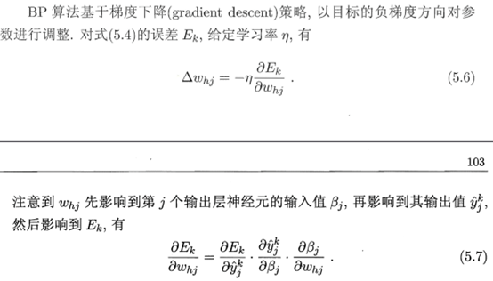

### CH01 绪论

一、填空

1、机器学习的目标是使学得的模型能很好地适用于新样本，而不是仅仅在训练样本上工作得很好，学得模型适用于新样本的能力，称为**泛化能力**。

2、根据**训练数据是否拥有标记信息（Label）**，学习任务可以大致分为监督学习和无监督学习。

二、简答

1、如何定义机器学习？

**答：机器学习是一门致力于研究如何通过计算的手段，利用经验（通常以数据的形式存在）来改善系统自身性能的学科。**

2、解释机器学习术语：什么时特征，什么是标签。

**答：特征（Feature）是反应事件或对象在某方面的表现或性质的事项。标签（Label）是关于示例结果的信息，比如分类任务中的类别“好瓜/坏瓜”。**

3、最常见的两种监督学习任务是什么？

**答：分类（Classification）和回归（Regression）。**

---

### CH02 模型评估与选择

1、以二分类任务为例，假定数据集D包含1000个样本，将其划分为训练集S和测试集T，其中S包含800个样本， T包含200个样本，用S进行训练后，如果模型在T上有50个样本分类错误，那么模型的正确率为**75%** （(200-50)/200）。

2、PR（Precision-Recall）曲线的横轴和纵轴分别是**查全率（Recall）**和**查准率（Precision）**。

3、ROC曲线的横轴和纵轴分别是**假正例率（FPR）**和**真正例率（TPR）**。

4、对于二分类问题，可将样本根据其真实类别与学习器预测类别的组合划分为真正例（true positive，TP）、假正例（false positive，FP）、真反例（true negative，TN）和假反例（false negative，FN）四种情形，请画出分类结果的混淆矩阵。

**答：**

|        真实 \ 预测        | 正例 (Positive) | 反例 (Negative) |
| :-----------------------: | :-------------: | :-------------: |
| **正例 (Positive)** |   TP (真正例)   |   FN (假反例)   |
| **反例 (Negative)** |   FP (假正例)   |   TN (真反例)   |

5、F1度量是综合考虑了查准率和查全率的性能度量指标，请写出其公式。

**答：** $F1 = \frac{2 \times P \times R}{P + R} = \frac{2TP}{2TP + FP + FN}$

6、有多种因素可能导致过拟合，其中最常见的情况是由于**学习能力过强**，以至于把训练样本所包含的不太一般的特性都学到了，而欠拟合则通常是由于**学习能力低下**而造成的。

7、查准率和查全率是分类任务中常用的性能度量指标，请写出其公式并对这两种指标进行分析。

**答：**

* 查准率 $P = \frac{TP}{TP + FP}$，表示预测为正例的样本中真正为正例的比例。
* 查全率 $R = \frac{TP}{TP + FN}$，表示所有真实正例中被正确预测出来的比例。
* **分析**：查准率和查全率通常是一对矛盾的变量。查准率高时，查全率往往偏低；而查全率高时，查准率往往偏低。例如，若希望将好瓜尽可能多地选出来，则可以通过增加选瓜的数量来实现，此时查全率高，但查准率可能会降低。

8、简述k折交叉验证法。

**答：将数据集D划分为k个大小相似的互斥子集 $D_1, D_2, \dots, D_k$。每次用 $k-1$ 个子集的并集作为训练集，余下的那个子集作为测试集；这样就可以获得 $k$ 组训练/测试集，从而可以进行 $k$ 次训练和测试，最终返回这 $k$ 个测试结果的均值。**

9、分析偏差和方差的含义。

**答：**

* **偏差（Bias）**：度量了学习算法的期望预测与真实结果的偏离程度，即刻画了学习算法本身的拟合能力。
* **方差（Variance）**：度量了同样大小的训练集的变动所导致的学习性能的变化，即刻画了数据扰动所造成的影响。

10、对于一个三分类问题，数据集的真实标签和模型预测标签如下：

| 真实标签 | 1 | 1 | 2 | 2 | 2 | 3 | 3 | 3 | 3 |
| -------- | - | - | - | - | - | - | - | - | - |
| 预测标签 | 1 | 2 | 2 | 2 | 3 | 3 | 3 | 1 | 2 |

分别计算模型的精确率、召回率、F1值以及它们的宏平均和微平均。

**答：**

* **混淆矩阵统计**：

  * 类1：TP=1 (样本1), FP=1 (样本8), FN=1 (样本2)。$P_1=1/2$, $R_1=1/2$, $F1_1=0.5$。
  * 类2：TP=2 (样本3,4), FP=2 (样本2,9), FN=1 (样本5)。$P_2=2/4=0.5$, $R_2=2/3$, $F1_2 \approx 0.57$。
  * 类3：TP=2 (样本6,7), FP=1 (样本5), FN=2 (样本8,9)。$P_3=2/3$, $R_3=2/4=0.5$, $F1_3 \approx 0.57$。
* **宏平均 (Macro)**：

  * Macro-P = $(1/2 + 1/2 + 2/3) / 3 = 10/18 \approx 0.556$
  * Macro-R = $(1/2 + 2/3 + 1/2) / 3 = 10/18 \approx 0.556$
  * Macro-F1 = $(0.5 + 0.571 + 0.571)/3 \approx 0.547$
* **微平均 (Micro)**：

  * 总 TP = 1 + 2 + 2 = 5。总样本数 = 9。
  * Micro-P = Micro-R = Micro-F1 = $5/9 \approx 0.556$。

---

### CH03 线性模型

1、在梯度下降过程中，学习率控制着算法每一轮迭代中的更新步长，如果学习率设置的太大容易振荡，设置太小则**收敛速度过慢**。

2、均方误差有非常好的几何意义，它对应了常用的欧氏距离。基于均方误差最小化来进行模型求解的方法称为**最小二乘法（Least Square Method）**。

3、如果使用数据集的全部特征，学习模型在训练集上达到100%的准确率，但在测试集上仅能达到70%左右，这说明存在**过拟合（Overfitting）**问题。

4、训练对数几率回归分类模型，如果在模型中引入正则项，正则化参数会对模型的性能有很大的影响，如果设置的过小则不能缓解过拟合问题，如果设置的过大则**导致欠拟合（Underfitting）**。

5、在预测任务中，给定样本集D={(x1,y1),(x2,y2),…,(xm,ym)}，其中yi是样本xi的真实标记。要评估学习器f的性能，就要把学习器预测结果f(x)与真实标记y进行比较。回归任务最常用的性能度量是均方误差，请写出对应的公式。

**答：** $E(f;D) = \frac{1}{m} \sum_{i=1}^{m} (f(x_i) - y_i)^2$

6、线性回归模型是用线性模型的预测值逼近样本的真实标记，对数几率回归模型是用线性回归模型的预测结果去逼近真实标记的**对数几率（Log Odds / Logit）**。

7、请简单介绍梯度下降算法，并给出梯度下降算法的步骤。

**答：梯度下降是一种一阶最优化算法，用于求解函数的局部最小值。步骤如下：**

1. **初始化**：随机选择参数 $\theta$ 的初始值。
2. **计算梯度**：计算损失函数 $J(\theta)$ 关于参数 $\theta$ 的梯度 $\nabla J(\theta)$。
3. **更新参数**：沿负梯度方向更新参数，$\theta \leftarrow \theta - \alpha \nabla J(\theta)$，其中 $\alpha$ 是学习率。
4. **迭代**：重复步骤2和3，直到梯度接近0或达到最大迭代次数。

8、Logistic回归（Logistic Regression，LR）是一种常用的处理二分类问题的线性模型。Softmax 回归（Softmax Regression），也称为多项（Multinomial）或多类（Multi-Class）的Logistic回归，是Logistic回归在**多分类**问题上的推广。

9、Logistic 回归采用**对数似然损失函数（Log-Likelihood Loss）**作为损失函数，并使用**梯度下降法（Gradient Descent）**（或牛顿法等）来对参数进行优化。

10、对数几率回归模型中，请写出样本x属于类别{0,1}的概率公式。

**答：** $P(y=1|x) = \frac{1}{1 + e^{-(w^Tx+b)}} = \frac{e^{w^Tx+b}}{1 + e^{w^Tx+b}}$ , $P(y=0|x) = \frac{1}{1 + e^{w^Tx+b}}$

**pic**

11、基于一些基本策略，可以利用二分类学习器解决多分类问题。多分类学习的基本思路是“拆解法”，将多分类任务拆为若干个二分类任务求解。最经典的拆分策略有一对一、一对多和多对多策略。如果给定数据集D中包含M个样本，对应有N个类别，请分析一对一、一对多和多对多策略。

**答：**

* **一对一 (OvO)**：将N个类别两两配对，产生 $N(N-1)/2$ 个二分类任务。预测时投票产生结果。
* **一对多 (OvR)**：每次将一个类别作为正例，其余所有类别作为反例，训练N个分类器。预测时选择置信度最高的类别。
* **多对多 (MvM)**：如ECOC（纠错输出码），将若干类作为正类，若干类作为反类。

12、请介绍什么是极大似然估计？如何基于极大似然估计推导出对数几率回归中的l(β)函数（式3.27）。

**答：课本P.59**

* **极大似然估计 (MLE)**：一种根据观测数据推断概率模型参数的方法。其核心思想是：找到一组参数，使得已观测到的数据出现的概率（似然）最大。
* **推导思路**：
  对于对数几率回归，设 $p_1(\hat{x};\beta) = P(y=1|\hat{x};\beta)$，则 $P(y|\hat{x};\beta) = [p_1(\hat{x};\beta)]^y [1-p_1(\hat{x};\beta)]^{1-y}$。
  似然函数 $L(\beta) = \prod_{i=1}^{m} [p_1(\hat{x}_i;\beta)]^{y_i} [1-p_1(\hat{x}_i;\beta)]^{1-y_i}$。
  对数似然 $\ell(\beta) = \ln L(\beta) = \sum_{i=1}^{m} (y_i \ln p_1(\hat{x}_i;\beta) + (1-y_i) \ln (1-p_1(\hat{x}_i;\beta)))$。
  最大化 $\ell(\beta)$ 即求解最优对数几率回归模型。

---

### CH04 决策树

1、决策树是一类常见的机器学习方法，是基于树结构进行决策的。一般的，一棵决策树包含两类结点：内部节点和叶结点，其中内部节点表示表示一个特征或属性，叶结点表示**类别（对于分类任务）或预测值（对于回归任务）**。

2、在决策树学习中，一般情况下，属性a的信息增益越大，则意味着使用属性a来进行划分获得的**纯度提升越大（或不确定性减少越多）**。

3、信息增益准则对**可取值数目较多**的属性有所偏好，增益率准则对**可取值数目较少**的属性有所偏好。

4、在决策树学习中，C4.5决策树算法中采用**二分法 (Bi-partition)**对连续属性进行离散化处理。

5、决策树学习算法包括3部分：特征选择、树的生成和树的剪枝。特征选择的目的在于选择对训练数据能够分类的特征。特征选择的关键是其准则，常用的准则有哪些，请简单描述。

**答：**

* **信息增益 (ID3)**：基于熵减少的程度。
* **增益率 (C4.5)**：信息增益除以固有值（IV），惩罚多值属性。
* **基尼指数 (CART)**：反映从数据集中随机抽取两个样本，其类别标记不一致的概率。

6、目标变量在训练集上的 10 个实际值 [0,0,0,0,1,1,1,1,1,1]，则目标变量的熵是____________________。

**答：**
数据集包含4个0，6个1。$p_0 = 0.4, p_1 = 0.6$。
Entropy = $-(0.4 \log_2 0.4 + 0.6 \log_2 0.6) \approx -(0.4 \times -1.322 + 0.6 \times -0.737) \approx 0.971$。

7、C4.5决策树算法中采用**与之对应的增益率（Gain Ratio）**对连续属性进行处理。（注：C4.5处理连续值先用二分法，然后选增益率最高的划分点）。

8、常用的决策树学习算法有ID3、C4.5和CART，介绍它们采用的特征选择准则是什么？

**答：ID3使用信息增益；C4.5使用增益率；CART使用基尼指数（Gini Index）。**

9、简述决策树生成与决策树剪枝。

**答：**

* **生成**：从根结点开始，递归地选择最优特征进行分裂，直到满足停止条件（如结点纯度高或无特征可用）。
* **剪枝**：为了防止过拟合，对生成的树进行修剪，去掉过于细分的枝叶。

10、决策树剪枝的基本策略有预剪枝和后剪枝，请简述并分析两种剪枝策略。

**答：**

* **预剪枝**：在生成过程中，对每个结点在划分前进行估计，若划分不能带来性能提升则停止划分。优点是速度快，缺点是可能通过贪心导致欠拟合。
* **后剪枝**：先生成完整的树，然后自底向上考察非叶结点，若将该子树替换为叶结点能带来性能提升则进行替换。优点是欠拟合风险小、泛化性能往往更好，缺点是计算开销大。

11、根据表4.1中的西瓜数据集，计算属性“纹理”的信息增益。

**答：**
（基于西瓜数据集2.0标准数据）
$Gain(D, \text{纹理}) = Ent(D) - \sum_{v} \frac{|D^v|}{|D|} Ent(D^v) = 0.381$。

---

### CH05 神经网络

1、考虑下面的神经网络，有二进制值输入 **$x_1, x_2 \in \{0,1\}$**，输出为 **$h_\Theta(x)$**。该网络计算（近似）下列哪个逻辑函数？(A)
（图示：偏置单元 +1 权重为 -20，输入 **$x_1$** 权重为 30，输入 **$x_2$** 权重为 30）
选项：OR, AND, NAND, XOR

2、下面的描述是否正确？在前面的括号中填True/False。

（ **False** ）（1）一个两层（一个输入层，一个输出层；没有隐含层）的神经网络可以表示XOR函数。（需要隐含层解决非线性问题）

（ **True** ）（2）在神经网络中，如果每层都是用sigmoid函数作为激活函数，那么隐藏层神经单元的激活值在（0,1）范围内。

$$
输入 x \xrightarrow{Layer 1} \underbrace{(0, 1)}_{\text{激活值 } a^{[1]}} \xrightarrow{\text{乘以权重 } w^{[2]} \text{ 加偏置 } b^{[2]}} \underbrace{(-\infty, +\infty)}_{\text{线性值 } z^{[2]}} \xrightarrow{Layer 2 的 Sigmoid} (0, 1)
$$

（ **True** ）（3）如果神经网络在训练集上过拟合，一种合理的解决方法是提高正则化参数λ的值。

（ **True** ）（4）假设正确地实现了反向传播算法，并且使用梯度下降来训练一个神经网络。如果把J(θ)作为迭代次数的函数，并且发现它是递增的而不是递减的。一个可能的原因是，学习速率太大了。

（ **True** ）（5）如果使用梯度下降来训练一个神经网络，一个合理的“调试”步骤以确保它的工作是将J(θ)作为迭代次数的函数，并确保在每次迭代之后它正在减少（或者至少不是增加）。

（ **False** ）（6）假定我们使用学习率为α的梯度下降。对于对数几率回归和线性回归，J(θ)是一个凸优化问题，因此我们不会选一个太大的学习率。然而对于神经网络，J(θ)可能是非凸的，因此选择一个非常大的α可以加速收敛。（非凸函数用过大α更易导致震荡发散）。

3、M-P神经元模型中，神经元接收来自其他神经元传递过来的输入信号，这些输入信号通过**带权重的连接（Weights）**进行传递，神经元接收到的总输入值与**阈值（Threshold）**进行比较，然后通过**激活函数（Activation Function）**处理以产生神经元的输出。

4、误差逆传播算法（BP算法）基于**梯度下降（Gradient Descent）**策略，以目标的负梯度方向对参数进行调整。

5、假定一个单隐层的前馈神经网络，拥有m个输入神经元,n个输出神经元、q个隐层神经元，那么该神经网络中需要确定的连接权重参数有多少个？

**答：** $m \times q$ (输入层到隐层权重) + $q$ (隐层阈值) + $q \times n$ (隐层到输出层权重) + $n$ (输出层阈值) = $(m+n+1)q + n$。
（注：有时阈值也被看作连接权重，总数为 $(m+1)q + (q+1)n$）。

6、常用来缓解BP网络的过拟合的策略有什么？

**答：早停（Early Stopping）和正则化（Regularization）。**

7、请简述感知机模型，感知机的学习策略与学习算法。

**答：**

* **感知机**：二类分类的线性分类模型，通过分离超平面将数据分为两类。
* **策略**：最小化误分类点到超平面的总距离（损失函数）。
* **算法**：随机梯度下降（SGD）。对于误分类点，调整权重使超平面向该点移动，直到所有点正确分类（线性可分时收敛）。

8、误差逆传播（error BackPropagation，简称BP）算法是神经网络学习算法，简述使用BP算法训练多层前馈神经网络的工作过程。

**答：**

1. **前向传播**：输入信号经隐层逐层处理，传向输出层，计算输出结果。
2. **误差计算**：计算输出层与真实标签的误差。
3. **反向传播**：将误差按原连接通路反向计算各层误差信号，并据此调整各层神经元的连接权值和阈值。
4. **迭代**：重复上述过程直到误差满足条件。

9、简述标准BP算法与累积BP算法的区别。

**答：**

* **标准BP**：针对**每一个训练样本**更新一次参数。更新频繁，收敛震荡较大，但可能跳出局部极小。
* **累积BP**：针对**整个训练集**（或一个Batch）计算总误差后更新一次参数。更新频率低，收敛较稳。

10、课后习题5.4。 -> 试述式(5.6)中学习率的取值对神经网络训练的影响

$$
\Delta w_{hj} = -\eta \frac{\partial E_k}{\partial w_{hj}}
$$

**答：（请参考教材习题解答，通常涉及推导梯度公式或编写代码实现）** (已按要求跳过具体解答)

1. 学习率过大（η 太大）

震荡不收敛：更新步长过大，容易跨越最优点，在最优解附近来回震荡

发散：可能导致损失函数值不断增大，训练完全失败

2. 学习率过小（η 太小）

收敛缓慢：每次更新步长太小，需要大量迭代才能接近最优解

训练时间长：达到相同精度需要更多的训练轮数

---

### CH06 支持向量机

1、试证明样本空间中任意点x到超平面(w,b)的距离公式为6.2。

**答：** 距离公式为 $r = \frac{|w^Tx + b|}{||w||}$。
参考链接: https://zhuanlan.zhihu.com/p/49023182

2、对于软间隔支持向量机，每个样本都有一个对应的松弛变量，用以表征**该样本不满足约束的程度（即误分类的程度或进入间隔的程度）**。

3、在软间隔SVM的优化目标函数中，参数C表示**对误分类的惩罚力度（C越大，越不能忍受误分类；C越小，容错能力越强）**。

4、在SVM训练好之后，可以不考虑**非支持向量**的样本点，仍然可以对新样本进行分类。

5、在决定分离超平面时，只有**支持向量**起作用。如果移动这些实例点将改变所求的解；但是在间隔边界以外移动其他实例点，甚至去掉这些点，则解是不会改变的。

6、对于求解线性分类问题，线性分类支持向量机是一种非常有效的方法。如果分类问题是非线性的，可以将样本**映射到高维特征空间**，使得样本在这个特征空间内线性可分，利用核函数可以隐式地定义特征空间。

7、在决定分离超平面时，只有**支持向量**起作用。（重复问题）

8、给定线性可分训练数据集T={(x1,y1),(x2,y2),…,(xN,yN)}，yi∈{−1,+1}，请构造线性可分支持向量机学习的最优化问题。假定求得最优解w∗，b∗，请给出最大间隔分离超平面。

**答：**

* **最优化问题**：
  $\min_{w,b} \frac{1}{2}||w||^2$
  $s.t. \ y_i(w^Tx_i + b) \ge 1, \ i=1,2,\dots,N$
* **最大间隔分离超平面**：
  $w^{*T}x + b^* = 0$

9、试述SVM软间隔与SVM硬间隔的区别。

**答：**

* **硬间隔 (Hard Margin)**：要求所有的训练样本都严格满足约束（即分类正确且在间隔之外），仅适用于线性可分数据，对噪声敏感。
* **软间隔 (Soft Margin)**：允许部分样本不满足约束（即允许少量误分类），引入松弛变量和惩罚参数C，适用于线性不可分或有噪声的数据，泛化能力更强。

10、试述机器学习中L1正则化和L2正则化。

**答：**

* **L1正则化 (Lasso)**：权值向量w的L1范数（绝对值之和）。能产生**稀疏解**，即许多w变为0，因此可用于特征选择。
* **L2正则化 (Ridge/Tikhonov)**：权值向量w的L2范数（平方和）。能抑制参数过大，防止过拟合，使模型更平滑。
